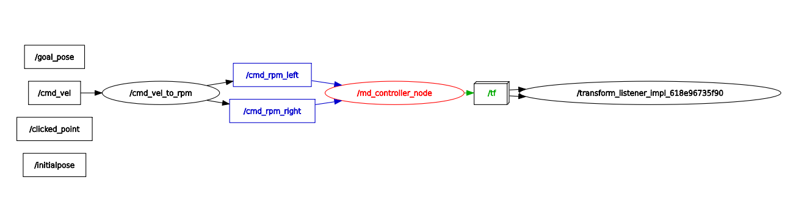

[](https://hits.seeyoufarm.com)
# MD_controller
ROS 2 (Humble) package for controlling **MDROBOT's dual-channel BLDC motor driver** [ https://www.mdrobot.co.kr ]

# rqt_graph



# how

/cmd_vel -> Parse linear.x, angular.z -> Compute v_left, v_right using differential model -> Convert to RPM -> Publish to /cmd_rpm_left and /cmd_rpm_right

## motor driver setup(port, buadrate ...)
in launch/md_controller.launch.py

Change parameters suitable for motor driver and motor.


## Dependencies
There is no official release of the serial package available for ROS2, so you need to install an unofficial version that is compatible with ROS2.

```
To install it, follow the steps below. (의존성 패키지인 serial-ros2는 따로 git clone 해주셔야 합니다)

~$ git clone https://github.com/RoverRobotics-forks/serial-ros2.git
~$ cd serial-ros2
~$ mkdir build
~$ cd build
~$ cmake ..
~$ make
~$ cd ..
~$ colcon build --packages-select serial
~$ cd build
~$ sudo make install
```
## build
```
~$ cd MD_controller
~/MD_controller$ colcon build
```
# Terminal 1

+ setup
```
~$ source ~/MD_controller/install/local_setup.bash
```
+ run cmd_vel_to_rpm
```
~$ ros2 run md_controller cmd_vel_to_rpm
```
# Terminal 2

+ setup
```
~$ source ~/MD_controller/install/local_setup.bash
```
+ run motor controller
```        
~$ ros2 launch md_controller md_controller.launch.py
```

